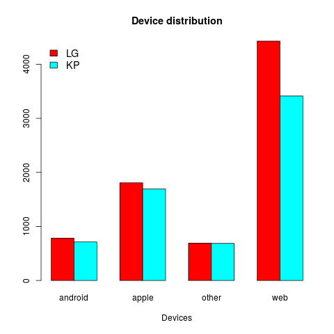

LGvsKPexample
=============

The task is to extend the current set of functions to plot device usage differences between Lady Gaga fans and Katy Perry fans.

### Inputs
A csv file with tweets, that contains 4 columns:
- id: tweet id
- text: tweet text
- created: unix timestamp
- source: a string describing the source (Twitter client software)

### Subtasks
- Add a new column to the data frame, called "sourceType" that contains factors of 4 levels, based on the original "source" column. The possible values should be "android", "apple", "web", and "other". Use string matching to decide which group a row belongs to.
- Using the above, plot something like this:




## Hints


#### How to search in text

*Basic way:* use the grep(pattern, text) or grepl(pattern, text) functions. For more help:
```R
> ?grep()
```

*Better way:* use functions from the <a href="http://cran.r-project.org/web/packages/stringr/stringr.pdf" stringr package</a>.
To match a patterns in a whole vector/column at once and get a boolean vector:
```R
> sttVec <- c("Hello my Little Pony", "hello again", "ttt", "my li")
> str_detect(sttVec, ignore.case("hello"))
[1]  TRUE  TRUE FALSE FALSE
> str_detect(sttVec, ignore.case("my LI"))
[1]  TRUE FALSE FALSE  TRUE
```

(<a href="http://gastonsanchez.com/Handling_and_Processing_Strings_in_R.pdf"> More help for string manipulations</a>)

#### How to transform source strings to a new column with factors

How to transform a vector of strings to factors:
```R
as.factor(myStringVec)
```

How to add a new column with a name to a data frame:
```R
myDf$newColName <- myVectorWithValues
```

#### How to create a simple bar plot from the sourceType column

```R
counts <- table(tweetDf$sourceType)
barplot(counts, main="Device distribution", xlab="Devices")
```

#### How to find 
